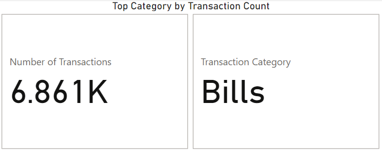
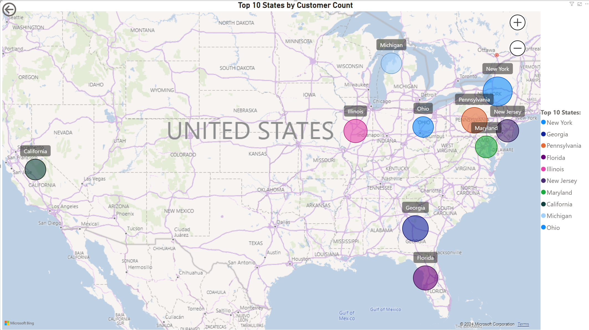
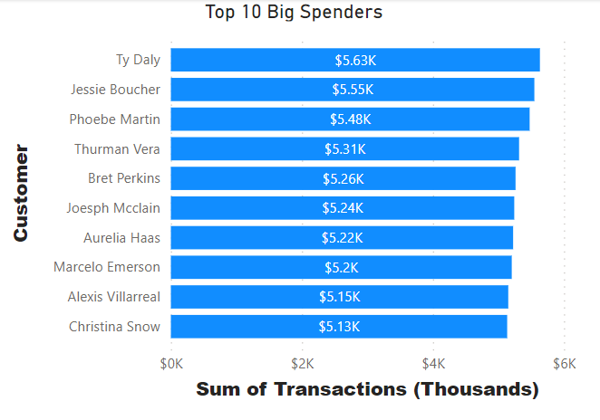
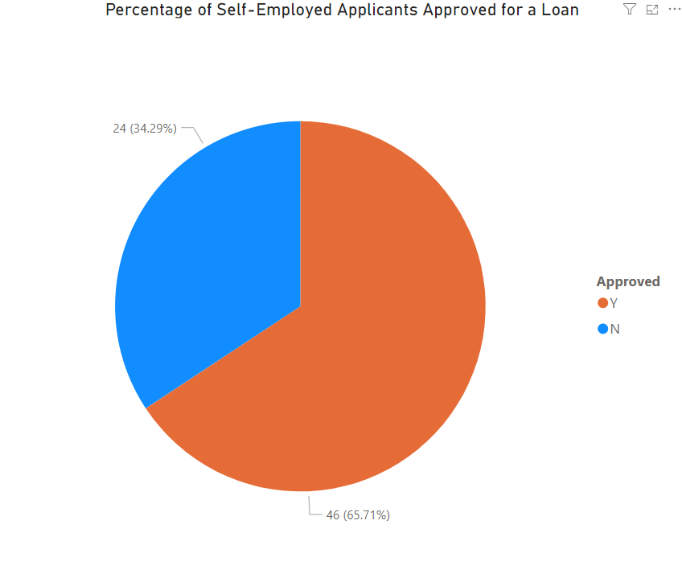
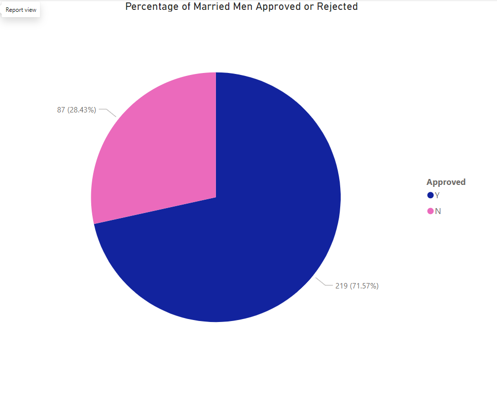
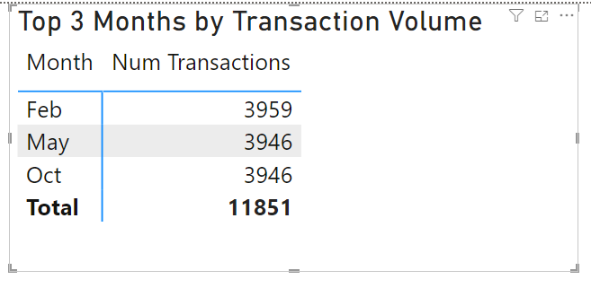
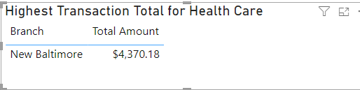

# Report 405 - DA Capstone

## Christopher Nicholson - 1st March, 2024

### Summary of Jira Sprints

In the [Jira sprints](./Jira/) we learned how to implement Scrum methodology and use the Jira tool while practicing the concepts we learned in the accompanying module. For instance, we started a sprint, assigned issues to ourselves, wrote SQL scripts to address said issues, and closed the sprint with the appropriate documentation of our work done.

### Core Capstone Components

#### Load Credit Card Database (SQL)

The data for the credit card database were given to us in the form of three JSON files with data on [bank branches](./data/cdw_sapp_branch.json), credit-card [customers](./data/cdw_sapp_custmer.json), and credit-card [transactions](./data/cdw_sapp_credit.json) that we downloaded ahead of time.

In my solution I wrote modules using Python, PySpark, the MySQL connector for Python, and SQL to read the data from these files, transform those data according to specific mapping rules, and write those data to three tables in a locally-running instance of the MySQL RDBMS.

At application start, the module to [build the database](./build_database.py) is called first.  The build_database module will call a [module for reading data](./cdw_data_reader.py) from JSON files to get the data into a suitable format for transforming and writing it to the database, that latter accomplished by using [data adapter class](./dbadapter.py) whose purpose is to perform all database operations, such as creating the database, creating tables, and CRUD operations, including reading data from tables into PySpark dataframe objects.  

#### Application Front-End

Once translated from JSON, transformed, and written to MySQL tables, the data are then available for an end-user to query, which is effected by launching a [menu module](./menu.py) as soon as the build_database module is finished.  This module will offer the user a menu of choices encoded as numbers:

```python
Tasks Menu
[1] - Get a list of transactions by ZIP, month, and year
[2] - Get transaction totals by category
[3] - Get transaction totals by branch
[4] - Get customer details
[5] - Update customer details
[6] - Generate credit card bill
[7] - Get customer transactions in date range
Type a number to perform one of the above tasks, 0 to exit:
```

The menu module contains methods to execute each option.  There is also a [utility module](./utils.py) to handle a couple of common tasks in this application: converting dates to TIMEIDs and restricting user input to whole numbers.

#### Data Analysis and Visualization

Using Microsoft [Power BI](https://https://www.microsoft.com/en-us/power-platform/products/power-bi/), we conducted several analyses of the data:

##### Credit Card data

###### Calculate and plot which transaction type has the highest transaction count



###### Calculate and plot top 10 states with the highest number of customers



###### Calculate the total transaction sum for each customer based on their individual transactions. Identify the top 10 customers with the highest transaction amounts (in dollar value). Create a plot to showcase these top customers and their transaction sums



##### Loan Application Data

###### Calculate and plot the percentage of applications approved for self-employed applicants. Use the appropriate chart or graph to represent this data



###### Calculate the percentage of rejection for married male applicants. Use the ideal chart or graph to represent this data



###### Calculate and plot the top three months with the largest volume of transaction data. Use the ideal chart or graph to represent this data



###### Calculate and plot which branch processed the highest total dollar value of healthcare transactions. Use the ideal chart or graph to represent this data



#### Functional Requirements - LOAN Application Dataset

### Conclusion

### Appendix
